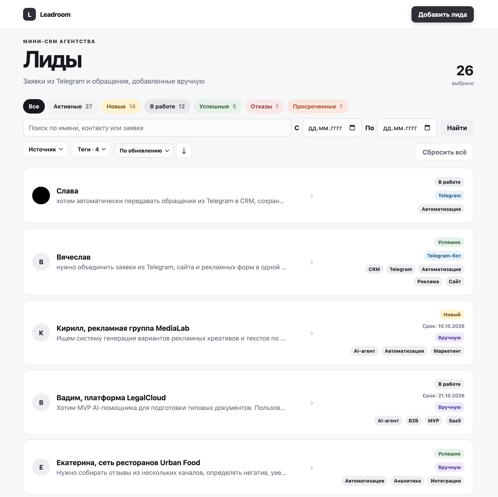
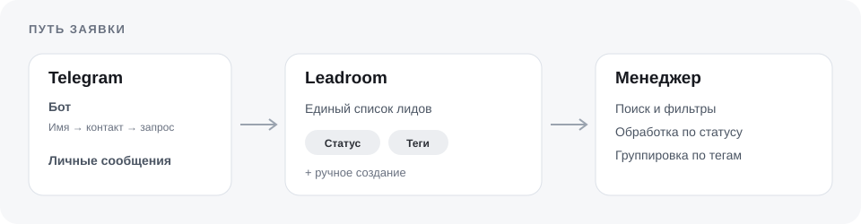

<h1 align="center">Leadroom</h1>

Мини-CRM для заявок агентства. Обращения из Telegram-бота и личных сообщений подключённого аккаунта попадают в общий список; менеджер может добавить лида вручную, назначить теги и отслеживать работу по статусам.

## Технологии

<p align="center">
  <a href="https://www.python.org/"></a>
  <a href="https://fastapi.tiangolo.com/"></a>
  <a href="https://jinja.palletsprojects.com/"></a>
  <a href="https://www.sqlalchemy.org/"></a>
  <a href="https://www.postgresql.org/"></a>
  <a href="https://docs.telethon.dev/"></a>
  <a href="https://docs.pytest.org/"></a>
  <a href="https://www.docker.com/"></a>
  <a href="https://render.com/"></a>
</p>

**[Открыть работающую CRM](https://agency-leads-crm.onrender.com/)** · [Проверить состояние сервиса](https://agency-leads-crm.onrender.com/health)

**Telegram-бот:** [@leadroom_agency_bot](https://t.me/leadroom_agency_bot)<br>**Telegram-аккаунт:** [@leadroom_agency_crm](https://t.me/leadroom_agency_crm)

> На бесплатном Render первый запуск после простоя может занять около минуты. Сначала дождитесь открытия CRM, затем проверяйте получение новых сообщений из обычного Telegram: фоновый клиент работает только пока сервис активен.

<p align="center">
  
</p>

## Как проходит заявка

<picture>
  <source media="(prefers-color-scheme: dark)" srcset="docs/assets/lead-flow-dark.svg">
  
</picture>

Бот спрашивает имя, контакт и запрос. После последнего ответа лид появляется в CRM. Для проверки полного сценария откройте [бота](https://t.me/leadroom_agency_bot), отправьте `/start`, ответьте на три вопроса, затем найдите нового лида в CRM, добавьте ему тег и включите фильтр по этому тегу. Заявки в публичной демоверсии общие для всех посетителей.

## Что умеет MVP

| Канал | Результат |
| --- | --- |
| Telegram-бот | Пошаговая заявка с защитой webhook и повторной доставки сообщения |
| Обычный Telegram | Первое личное сообщение создаёт лида; следующие дополняют обращение |
| CRM | Ручное создание, изменение, удаление, статусы, теги, поиск и фильтры |

Теги помогают группировать заявки; статус показывает этап обработки. Фильтр по нескольким тегам находит лидов с **любым** из выбранных тегов.

## Запуск локально

Нужны [uv](https://docs.astral.sh/uv/) и Docker. Настройки берутся из `.env.example`; реальные ключи и Telegram-сессию храните только в локальном `.env` или в секретах хостинга.

Установите зависимости:

```bash
uv sync
```

Создайте настройки:

```bash
cp .env.example .env
```

Поднимите PostgreSQL:

```bash
docker compose up -d db
```

Запустите приложение:

```bash
uv run uvicorn app.main:app --reload --env-file .env
```

CRM откроется по адресу [http://127.0.0.1:8000](http://127.0.0.1:8000). Проверка:

```bash
uv run pytest -q
```

Проверка: автоматические тесты покрывают создание и изменение лидов, теги, фильтры, сценарии Telegram-бота и подключённого обычного Telegram-аккаунта, а также защиту от повторной обработки сообщений. Для приёмки по заданию важен отдельный проход в живой версии: отправьте новое сообщение [боту](https://t.me/leadroom_agency_bot) и отдельное личное сообщение [подключённому Telegram-аккаунту](https://t.me/leadroom_agency_crm), затем убедитесь, что лиды появились в CRM.

Подключение Telegram-бота, обычного аккаунта и развёртывание описаны в [руководстве по настройке](docs/operations.md).

Исходники приложения находятся в `app/`, сценарии проверок — в `tests/`, конфигурация локальной БД — в `compose.yaml`, публикация на Render — в `render.yaml`.
